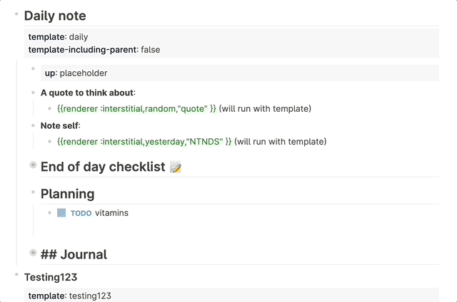
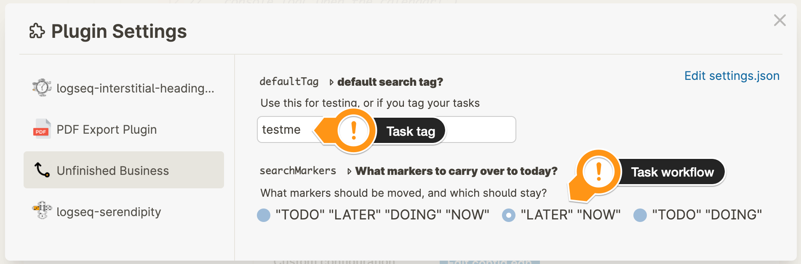

# Unfinished-business

This plugin migrates yesterdays unfinished tasks to todays journal. It is *meant* to be used in a template, but can be run mannually as well. It supports limiting tasks to specific markers or tags.

**Notice:** This plugin is in beta, make backups of your graph. It shouldn't, but *can* (theoratically) make tasks disappear in the digital void.

> I can't believe it! They keep following me. 
>
>— <cite>Unhappy customer</cite>

## Installation

### Preparation

- Click the 3 dots in the righthand corner and go to **Settings**.
- Go to **Advanced** and enable **Plug-in system**.
- Restart the application.
- Click 3 dots and go to Plugins (or `Esc t p`).

### Install plugin from the Marketplace (recommended) 

- Click the `Marketplace` button and then click `Plugins`.
- Find the plugin and click `Install`.

### Install plugin manually

- Download a released version assets from Github.
- Unzip it.
- Click `Load unpacked plugin`, and select destination directory to the unzipped folder.

## Using the plugin

The default way to use the plugin is place a *placeholder* in your `daily` template. Then, when the template is run at midnight, all tasks are moved to the newly created page. Use: `/move unfinished business here`.

As an alternative, go to the location you want to gather the unfinished tasks, use `/move unfinished business here`, correct (or remove) the tag, leave the block, and the tasks will be migrated.

**Important:** the placeholder, by default looks like this: `{{renderer :unfinishedBusiness, testme}}` to migrate *all* tasks remove both the tag **and the comma!**: `{{renderer :unfinishedBusiness}}`

## Configuration

- Click the 3 dots in the righthand corner and go to **Settings**.
- Go to **Plugin Settings**.
- Select correct plugin.

- Change `testme` to the tag you use to migrate tasks, or leave empty, then *all* tasks will be migrated.
- Choose your favorite workflow. It will only migrate *these* tasks.

## Licence

[MIT](.LICENSE)

### Image license

### Font License

[OFL](./OFL.txt)

## Notes

This plugin is a partially is inspired by FIXME
