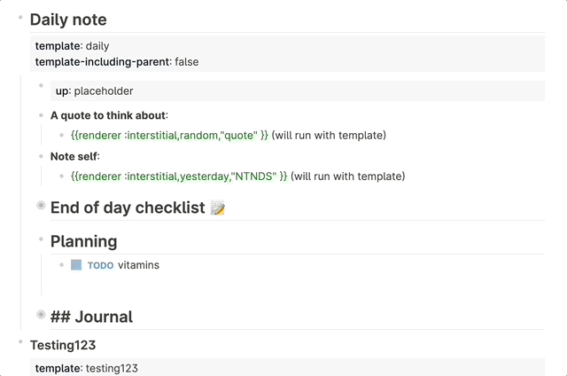

# Unfinished-business

<!--
*** Thanks for checking out Unfinished business. If you have a suggestion
*** that would make this better, please fork the repo and create a pull request
*** or simply open an issue with the tag "enhancement".
*** Don't forget to give the project a star!
*** Thanks again! Now go create something AMAZING! :D
-->

<!-- PROJECT SHIELDS -->
<!--
*** I'm using markdown "reference style" links for readability.
*** Reference links are enclosed in brackets [ ] instead of parentheses ( ).
*** See the bottom of this document for the declaration of the reference variables
*** for contributors-url, forks-url, etc. This is an optional, concise syntax you may use.
*** https://www.markdownguide.org/basic-syntax/#reference-style-links
-->
[![latest release version][release-shield]][release-url]
[![Forks][forks-shield]][forks-url]
[![Stargazers][stars-shield]][stars-url]
[![Issues][issues-shield]][issues-url]
[![MIT License][license-shield]][license-url]

<!-- PROJECT LOGO -->
 

  

<h3 align="center">Unfinished Business</h3>

  

    Because the day may be over, but your business isn't
     
    <a href="https://github.com/qwxlea/Unfinished-business">View Demo</a>
    ·
    <a href="https://github.com/qwxlea/Unfinished-business/issues">Report Bug</a>
    ·
    <a href="https://github.com/qwxlea/Unfinished-business/issues">Request Feature</a>
  

This plugin migrates yesterdays unfinished tasks to todays journal. It is *meant* to be used in a template, but *can* be run mannually as well. It supports limiting tasks to specific markers or tags.

> I can't believe it! They keep following me. 
>
>— <cite>Unhappy customer</cite>

**Notice:** This plugin is in beta, make backups of your graph. It shouldn't, but *can* (theoratically) make tasks disappear in the digital void.

<!-- TABLE OF CONTENTS -->

  
Table of Contents

  <ol>
    <li><a href="#installation">Installation</a></li>
    <li><a href="#Using the plugin">Using the plugin</a></li>
    <li><a href="#Configuration">Configuration</a></li>
    <li><a href="#license">License</a></li>
    <li><a href="#contact">Contact</a></li>
    <li><a href="#acknowledgments">Acknowledgments</a></li>
  </ol>

## Installation

### Preparation

- Click the 3 dots in the righthand corner and go to **Settings**.
- Go to **Advanced** and enable **Plug-in system**.
- Restart the application.
- Click 3 dots and go to Plugins (or `Esc t p`).

### Install plugin from the Marketplace (recommended) 

- Click the `Marketplace` button and then click `Plugins`.
- Find the plugin and click `Install`.

### Install plugin manually

- Download a released version assets from Github.
- Unzip it.
- Click `Load unpacked plugin`, and select destination directory to the unzipped folder.

## Using the plugin

The default way to use the plugin is place a *placeholder* in your `daily` template. Then, when the template is run at midnight, all tasks are moved to the newly created page. Use: `/move unfinished business here`.

As an alternative, go to the location you want to gather the unfinished tasks, use `/move unfinished business here`, correct (or remove) the tag, leave the block, and the tasks will be migrated.

**Important:** the placeholder, by default looks like this: `{{renderer :unfinishedBusiness, testme}}` to migrate *all* tasks remove both the tag **and the comma!**: `{{renderer :unfinishedBusiness}}`

(<a href="#top">back to top</a>)

## Configuration

- Click the 3 dots in the righthand corner and go to **Settings**.
- Go to **Plugin Settings**.
- Select correct plugin.

- Change `testme` to the tag you use to migrate tasks, or leave empty, then *all* tasks will be migrated.
- Choose your favorite workflow. It will only migrate *these* tasks.

### Imsure — for when you live dangerously

It is possible to run *unfinished business* on your *whole* graph. This can be dangerous, so has it's own flag:

`{{renderer :unfinishedBusiness, testme, imsure}}`

- **testme** would be the tag matched against
- **imsure** is to make sure you want it to check *all* your pages

Last, it is possible to run *unfinished business* on *all tasks* *all over your graph*: 

`{{renderer :unfinishedBusiness, imsure, imsure}}`

You know, just so you're *really* sure 😜.

(<a href="#top">back to top</a>)

## Licence

[MIT](.LICENSE)

### Image license

### Font License

[OFL](./OFL.txt)

(<a href="#top">back to top</a>)

<!-- CONTACT -->
## Contact

Alex Qwxlea - [@twitter_handle](https://twitter.com/QwxleaA) 

Project Link: [https://github.com/QWxleA/Unfinished-business](https://github.com/QWxleA/)

(<a href="#top">back to top</a>)

## Acknowledgments

This plugin is a partially is inspired by [Obsidian rollover daily todo](https://github.com/shichongrui/obsidian-rollover-daily-todos), thanks!

<!-- MARKDOWN LINKS & IMAGES -->
<!-- https://www.markdownguide.org/basic-syntax/#reference-style-links -->
[release-url]: (https://github.com/QWxleA/Unfinished-business)
[release-shield]: https://img.shields.io/github/v/release/qwxlea/unfinished-business?style=for-the-badge
[contributors-shield]: https://img.shields.io/github/contributors/QWxleA/Unfinished-business.svg?style=for-the-badge
[contributors-url]: https://github.com/QWxleA/Unfinished-business/graphs/contributors
[forks-shield]: https://img.shields.io/github/forks/QWxleA/Unfinished-business.svg?style=for-the-badge
[forks-url]: https://github.com/QWxleA/Unfinished-business/network/members
[stars-shield]: https://img.shields.io/github/stars/QWxleA/Unfinished-business.svg?style=for-the-badge
[stars-url]: https://github.com/QWxleA/Unfinished-business/stargazers
[issues-shield]: https://img.shields.io/github/issues/QWxleA/Unfinished-business.svg?style=for-the-badge
[issues-url]: https://github.com/QWxleA/Unfinished-business/issues
[license-shield]: https://img.shields.io/github/license/QWxleA/Unfinished-business.svg?style=for-the-badge
[license-url]: https://github.com/QWxleA/Unfinished-business/blob/master/LICENSE.txt
[product-screenshot]: images/screenshot.png